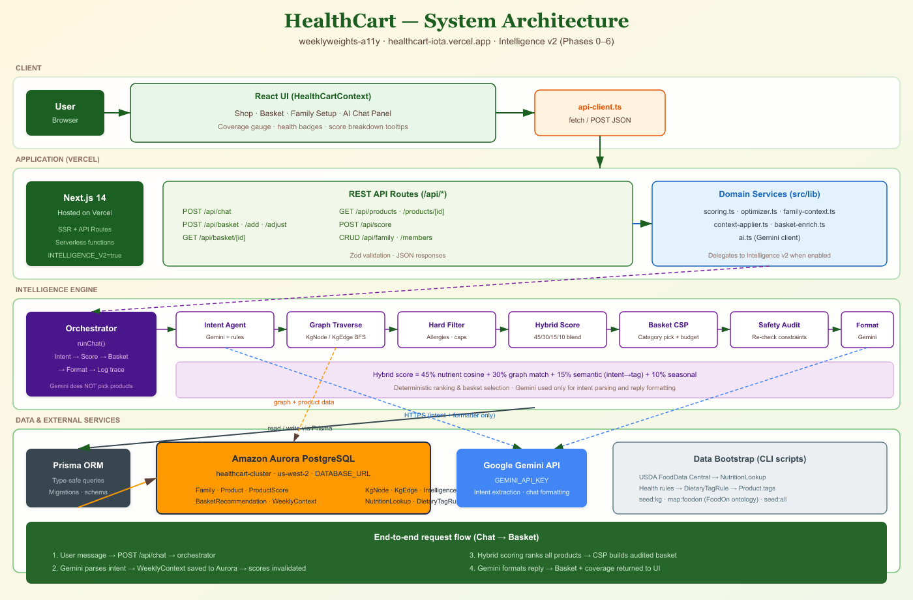

# HealthCart

**Your family's wellness starts here.**

HealthCart is an AI-powered grocery platform that reshapes itself around your household's health every week — allergies, chronic conditions, visiting relatives, budget, and mood included.

- **Live demo:** [healthcart-iota.vercel.app](https://healthcart-iota.vercel.app)
- **Repository:** [github.com/weeklyweights-a11y/Heath_Cart](https://github.com/weeklyweights-a11y/Heath_Cart)

---

## The problem

American families rarely shop for one person with one set of needs.

A typical household might include:

- A parent managing **cholesterol and pre-diabetes**
- A child with a **peanut allergy**
- A visiting relative who is **celiac**
- A weekly mood like **BBQ weekend** or someone with a **cold** who needs lighter, hydrating food

Mainstream grocery apps treat everyone the same. They do not:

1. **Personalize across the whole household** — one profile, one diet, one cart
2. **Enforce hard safety constraints** — allergies and condition-specific avoids must never slip into the basket
3. **Explain why a product was chosen** — shoppers need traceable reasoning, not a black-box recommendation
4. **Adapt week to week** — visiting guests, temporary illnesses, and budget changes should reshape the store in real time

HealthCart solves this by combining clinical health rules, USDA nutrition data, and a deterministic intelligence engine — with Gemini used only to understand natural language and write friendly replies, **not** to pick products.

---

## How it works

```
Chat → orchestrator → intent parsing → household state → graph traversal
     → hard safety filter → hybrid scoring → CSP basket builder
     → safety audit → formatted reply + scored shop + weekly basket
```

| Step | What happens |
|------|----------------|
| **Chat** | User describes the week in plain English ("Jake has a cold", "BBQ under $120", "Linda can't eat gluten") |
| **Intent parsing** | Gemini extracts structured context; rules fill gaps offline if no API key |
| **Household state** | Active members, conditions, allergies, weekly RDA targets, graph-derived tag requirements |
| **Hard filter** | Removes unsafe SKUs — peanuts for allergic members, gluten for celiac, sodium/sugar caps for diabetes |
| **Hybrid scoring** | Ranks every product: 45% nutrient match + 30% clinical graph + 15% intent→tag semantic + 10% seasonal |
| **Basket CSP** | Picks top items per category, scales quantities for household size, trims to budget, fairness pass |
| **Safety audit** | Re-checks the final basket before anything is shown or saved |
| **UI** | Shop badges, coverage gauge, per-member bars, and "Show evidence" graph paths |

**Principle:** Product selection is **deterministic**. Gemini never chooses SKUs.

---

## Architecture



### Client

React UI (Shop, Basket, Family Setup, AI Chat) talks to the backend through `api-client.ts`.

### Application (Vercel)

Next.js 14 serverless app with REST API routes:

| Route | Purpose |
|-------|---------|
| `POST /api/chat` | Natural-language week planning → basket + scores |
| `POST /api/basket` | Generate weekly basket |
| `POST /api/basket/add` · `/adjust` | Mutate basket with safety re-check |
| `GET /api/products` | Scored catalog with health badges |
| `CRUD /api/family` | Household profiles |

Domain logic lives in `src/lib/` (`scoring.ts`, `optimizer.ts`, `family-context.ts`) and delegates to **Intelligence Layer v2** when `INTELLIGENCE_V2=true`.

### Intelligence engine (v2)

| Module | Role |
|--------|------|
| **Orchestrator** | Coordinates chat → score → basket → format → trace log |
| **Intent agent** | Gemini + rule fallback → `ExtractedContext` |
| **Graph traverse** | BFS on `KgNode` / `KgEdge` in Postgres → required/avoid/preferred tags |
| **Hard filter** | Allergies, vegetarian, nutrient caps |
| **Hybrid score** | Nutrient cosine + graph match + semantic + seasonal |
| **Basket CSP** | Category selection, quantities, budget trim |
| **Safety audit** | Final constraint pass |
| **Formatter** | Gemini writes reply using **only** audited product names |

### Data & external services

| Service | Role |
|---------|------|
| **Amazon Aurora PostgreSQL** | Families, products, scores, baskets, weekly context, knowledge graph, audit logs |
| **Prisma ORM** | Type-safe queries and migrations |
| **Google Gemini API** | Intent extraction and chat formatting only |
| **USDA FoodData Central** | Nutrition facts → product tags via dietary rules |
| **FoodOn ontology** | Product ↔ clinical concept mapping (`map:foodon`) |

---

## Stack

| Layer | Technology |
|-------|------------|
| Frontend | Next.js 14, React, Tailwind CSS |
| Hosting | [Vercel](https://vercel.com) |
| Database | Amazon Aurora PostgreSQL (AWS) |
| ORM | Prisma |
| AI | Google Gemini Flash |
| Data | USDA FoodData Central, FoodOn (CC BY 4.0) |

---

## Quick start

```bash
git clone https://github.com/weeklyweights-a11y/Heath_Cart.git
cd Heath_Cart
npm install
cp .env.example .env.local
```

Set in `.env.local`:

| Variable | Purpose |
|----------|---------|
| `DATABASE_URL` | Aurora PostgreSQL connection string |
| `GEMINI_API_KEY` | Google AI Studio key |
| `INTELLIGENCE_V2` | `true` (default) — enables v2 intelligence pipeline |

```bash
npx prisma generate
npx prisma migrate deploy
npm run seed:kg
npm run seed:all
npm run map:foodon
npm run dev
```

Open [http://localhost:3000](http://localhost:3000).

### Production bootstrap

```bash
npx prisma migrate deploy
npm run import:rules
npm run seed:kg
npm run seed:all
npm run map:foodon
npm run verify:v2-ready
```

On Vercel set `DATABASE_URL`, `GEMINI_API_KEY`, and `INTELLIGENCE_V2=true`.

---

## Key features

- **Multi-member household profiles** — age, conditions, allergies, temporary visitors
- **Real-time product scoring** — recommended / limit / avoid badges with score breakdown tooltips
- **Weekly basket optimizer** — category coverage, per-member nutritional coverage gauge, budget re-optimize
- **Safety-first adds** — blocked items explain why (e.g. peanut butter for peanut-allergic member)
- **Chat-driven context** — "Jake has a cold" updates scores and basket for the whole week
- **Full traceability** — graph paths and constraints checked shown in basket evidence panel

---

## Project structure

```
src/
  app/              Next.js pages + API routes
  components/       Shop, Basket, Chat, Family UI
  context/          HealthCartContext (client state)
  lib/
    intelligence/   v2 engine (orchestrator, graph, scoring, basket CSP)
    scoring.ts      Entry point — delegates to v2 when enabled
    optimizer.ts    Basket generation and mutations
public/
  architecture.png  System architecture diagram (submission-ready)
prisma/             Schema + migrations
data/scripts/       USDA import, tag generation, KG seed, FoodOn mapping
```

---

## License

MIT — see [LICENSE](./LICENSE).
